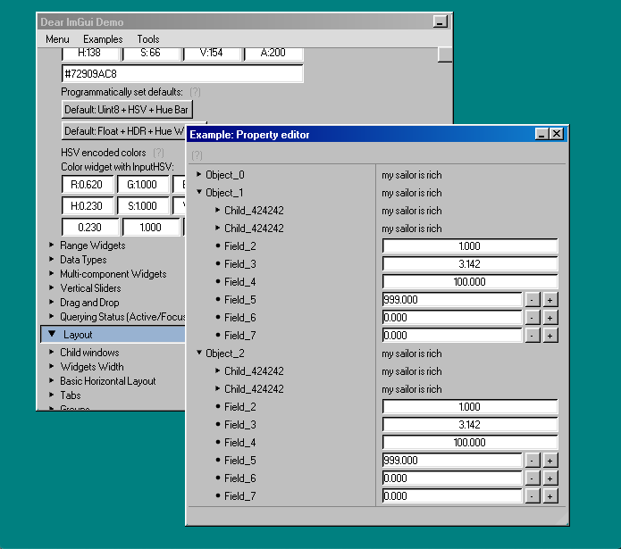

This is a fork of [Dear ImGui](https://github.com/ocornut/imgui) to style based on Windows 98

[Compare diff from master](https://github.com/JakeCoxon/imgui-win98/compare/master...JakeCoxon:win98)

---

This is rebased commits version of [JakeCoxon/imgui-win98](https://github.com/JakeCoxon/imgui-win98/issues/3)

For non rebase version, check out [`external/win98`](https://github.com/ocornut/imgui/tree/external/win98)

[Patch file](imgui-93c15e3-86049c5.patch) is included for preservation.
